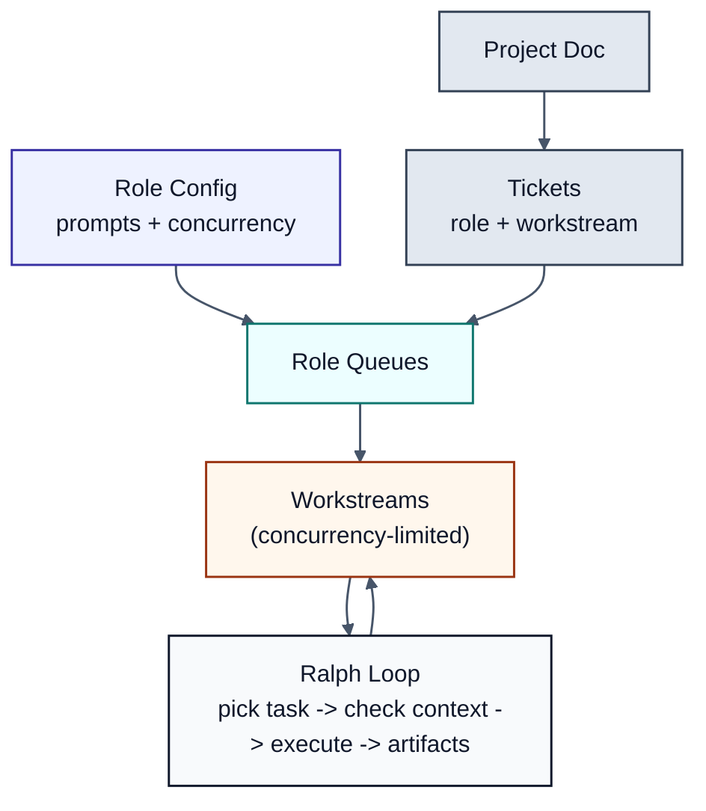

# 🦝 Tanuki 🐾

**Multi-agent orchestration for code agents.** Spawn isolated Claude Code instances — each with
their own git worktree and Docker container — to work on tasks in parallel without risking your host
machine.



## Why Tanuki?

Running AI agents directly on your machine is risky — a hallucinating agent can delete files,
corrupt your repo, or worse. Tanuki solves this by:

- **Isolating each agent** in its own Docker container and git worktree
- **Letting agents work in parallel** on separate branches without conflicts
- **Providing safe review** before any changes touch your main branch
- **Automating task distribution** across multiple specialized agents

## Features

- **Isolated Agents** — Each agent gets a dedicated git branch and Docker container
- **Parallel Execution** — Run multiple Claude Code instances simultaneously
- **Role System** — Define role-specific prompts and capabilities
- **Projects + Tickets** — Project doc plus role-tagged tickets drive the workflow
- **Workstreams** — Concurrency-limited workers per role that pick tasks in order
- **Shared Services** — Run Postgres, Redis, and custom services accessible to all agents
- **Ralph Loop Execution** — Single execution mode with completion signals and verification
- **TUI Dashboard** — Interactive terminal interface for monitoring and control
- **Git Integration** — Automatic worktree management, diff viewing, merge support

## Installation

### From Source

```bash
git clone https://github.com/bkonkle/tanuki
cd tanuki
make build
make install  # Installs to $GOPATH/bin
```

### Using Go

```bash
go install github.com/bkonkle/tanuki/cmd/tanuki@latest
```

### Docker Image

```bash
# Build locally
./scripts/build-image.sh

# Or pull from Docker Hub
docker pull bkonkle/tanuki:latest
```

## Quick Start

### Manual Workflow

```bash
# Initialize Tanuki in your project
cd your-project
tanuki init

# Spawn an agent with a role
tanuki spawn auth --role backend

# Send a task (Ralph loop by default)
tanuki run auth "Implement OAuth2 login with Google. Say DONE when finished."

# Monitor progress
tanuki status auth
tanuki logs auth --follow

# Review and merge changes
tanuki diff auth
tanuki merge auth
```

### Project Workflow (Automated)

```bash
# Initialize a project for authentication work
tanuki project init user-auth

# Describe the project in tasks/user-auth/README.md
cat > tasks/user-auth/README.md << 'EOF'
# Project: User Authentication

Goals:
- OAuth2 login with Google
- JWT-based session management

Roles: backend, frontend, qa
EOF

# Create task files in the project folder
cat > tasks/user-auth/001-backend-api-auth-endpoint.md << 'EOF'
---
id: user-auth-001
title: Implement Authentication Endpoint
role: backend
workstream: api
priority: high
completion:
  verify: "go test ./auth/..."
  signal: "AUTH_COMPLETE"
---
# Implement Authentication Endpoint

Add OAuth2-based authentication to the API.
EOF

# Start automated task distribution
tanuki project start user-auth

# Monitor with the dashboard
tanuki dashboard
```

## Commands

### Agent Management

| Command                             | Description                                |
| ----------------------------------- | ------------------------------------------ |
| `tanuki spawn <name>`               | Create a new agent with worktree/container |
| `tanuki spawn <name> --role <role>` | Create agent with a specific role          |
| `tanuki list`                       | List all agents and their status           |
| `tanuki status <name>`              | Show detailed agent status                 |
| `tanuki stop <name>`                | Stop an agent's container                  |
| `tanuki start <name>`               | Start a stopped agent                      |
| `tanuki remove <name>`              | Remove agent completely                    |

### Task Execution

| Command                                        | Description                                                 |
| ---------------------------------------------- | ----------------------------------------------------------- |
| `tanuki run <agent> "<prompt>"`                | Run in Ralph mode until completion signal or max iterations |
| `tanuki run <agent> "<prompt>" --verify "cmd"` | Ralph loop with verification                                |
| `tanuki logs <agent>`                          | View agent's Claude Code output                             |
| `tanuki logs <agent> --follow`                 | Stream logs in real-time                                    |
| `tanuki attach <agent>`                        | Attach to running Claude session                            |

### Git Operations

| Command                         | Description                |
| ------------------------------- | -------------------------- |
| `tanuki diff <agent>`           | Show changes made by agent |
| `tanuki diff <agent> --stat`    | Show diff statistics       |
| `tanuki merge <agent>`          | Merge agent's branch       |
| `tanuki merge <agent> --squash` | Squash merge               |
| `tanuki merge <agent> --pr`     | Create GitHub PR instead   |

### Projects

| Command                 | Description                                 |
| ----------------------- | ------------------------------------------- |
| `tanuki project init`   | Initialize project doc and ticket directory |
| `tanuki project start`  | Scan tickets, spawn workstreams, distribute |
| `tanuki project status` | Show ticket and workstream status           |
| `tanuki project stop`   | Stop all project workstreams                |
| `tanuki project resume` | Resume a stopped project                    |

### Shared Services

| Command                         | Description                   |
| ------------------------------- | ----------------------------- |
| `tanuki service start [name]`   | Start all or specific service |
| `tanuki service stop [name]`    | Stop all or specific service  |
| `tanuki service status`         | Show service health and ports |
| `tanuki service logs <name>`    | Stream service logs           |
| `tanuki service connect <name>` | Open interactive connection   |

### Role Management

| Command                     | Description                             |
| --------------------------- | --------------------------------------- |
| `tanuki role list`          | List available roles                    |
| `tanuki role show <role>`   | Show role configuration                 |
| `tanuki role init`          | Create .tanuki/roles/ for customization |
| `tanuki role create <name>` | Generate a custom role template         |

### Dashboard Command

| Command            | Description                    |
| ------------------ | ------------------------------ |
| `tanuki dashboard` | Open interactive TUI dashboard |

## Projects

Projects define the shared context for a Tanuki run. The workflow is:

Projects -> Roles -> Workstreams -> Tasks

Each project lives in its own folder under `tasks/` (e.g., `tasks/user-auth/`). The project's
`README.md` captures goals, constraints, and shared context. Tasks are Markdown files tagged with
a role and a named workstream (e.g., "api", "ui", "auth"). Roles must exist in `tanuki.yaml`,
which also defines role prompts and workstream concurrency.

The tasks directory defaults to `tasks/` but is configurable via `tasks_dir` in `tanuki.yaml`.

## Roles

Tanuki includes six built-in roles optimized for common development tasks. Each role can set its own
system prompt and concurrency in `tanuki.yaml`.

| Role        | Use Case                            | Example                              |
| ----------- | ----------------------------------- | ------------------------------------ |
| `backend`   | Server-side development, APIs, DBs  | `tanuki spawn api --role backend`    |
| `frontend`  | UI development, components, styling | `tanuki spawn ui --role frontend`    |
| `qa`        | Testing, QA (can only write tests)  | `tanuki spawn tests --role qa`       |
| `docs`      | Documentation, guides, READMEs      | `tanuki spawn docs --role docs`      |
| `devops`    | Infrastructure, CI/CD, deployment   | `tanuki spawn infra --role devops`   |
| `fullstack` | End-to-end feature development      | `tanuki spawn feat --role fullstack` |

### Custom Roles

Create custom roles in `.tanuki/roles/`:

```bash
tanuki role init
tanuki role create my-custom-role
vim .tanuki/roles/my-custom-role.yaml
```

## Workstreams

Workstreams let multiple agents of the same role work in parallel on different feature areas.
Each workstream has a descriptive name (e.g., "api", "auth", "ui", "database") that indicates
what aspect of the project it focuses on.

For example, if you have five backend tasks across two workstreams (`api` and `database`), you can
have two backend agents running simultaneously — one focused on API endpoints, another on database
migrations. Tasks within a workstream run sequentially, but different workstreams run concurrently.

Each workstream gets its own container and worktree. This gives you parallelism without conflicts —
agents in separate workstreams can't step on each other's changes.

Concurrency is configured per role. Setting `concurrency: 3` for the backend role means up to
three backend workstreams can run at once.

## Tasks

Tasks are Markdown files with YAML front matter in project folders. File names follow the pattern
`NNN-role-workstream-description.md` (e.g., `001-backend-api-auth-endpoint.md`):

```markdown
---
id: user-auth-001
title: Implement Authentication Endpoint
role: backend
workstream: api
priority: high
status: pending
depends_on: []

completion:
  verify: "npm test -- --grep 'auth'"
  signal: 'AUTH_COMPLETE'
  max_iterations: 20

tags:
  - auth
  - security
---

# Implement Authentication Endpoint

Add OAuth2-based authentication to the API.

## Requirements

1. **OAuth2 Flow** — Google as identity provider
2. **JWT Tokens** — 15min access, 7day refresh
```

### Task States

| State         | Description                             |
| ------------- | --------------------------------------- |
| `pending`     | Not yet started, waiting for assignment |
| `assigned`    | Agent assigned but not yet started      |
| `in_progress` | Agent actively working                  |
| `review`      | Work done, needs human review           |
| `complete`    | Verified and done                       |
| `failed`      | Failed and needs attention              |
| `blocked`     | Dependencies not satisfied              |

### Completion Criteria

Tasks support Ralph-style completion verification:

```yaml
# Verify command must exit 0
completion:
  verify: "npm test"

# Look for signal in output
completion:
  signal: "TASK_COMPLETE"

# Both (most reliable)
completion:
  verify: "npm test"
  signal: "ALL_TESTS_PASS"
  max_iterations: 20
```

## Configuration

Tanuki works without configuration using sensible defaults. Optionally create `tanuki.yaml`:

```yaml
version: '1'

# Task directory (defaults to "tasks", use ".tanuki/tasks" for hidden)
tasks_dir: tasks

image:
  name: bkonkle/tanuki
  tag: latest

network:
  name: tanuki

worktrees:
  prefix: tanuki
  base_dir: .tanuki/worktrees

defaults:
  max_turns: 50
  model: claude-sonnet-4-20250514

roles:
  backend:
    system_prompt: |
      You are a backend engineer focused on APIs and data stores.
      Prefer small, well-tested changes.
    concurrency: 3
  frontend:
    system_prompt: |
      You are a frontend engineer focused on UI and UX.
      Keep changes accessible and responsive.
    concurrency: 2
  qa:
    system_prompt: |
      You are a QA engineer. You can only add or change tests.
    concurrency: 1

services:
  postgres:
    enabled: true
    image: postgres:16
    port: 5432
    environment:
      POSTGRES_USER: tanuki
      POSTGRES_PASSWORD: tanuki
      POSTGRES_DB: tanuki_dev
    volumes:
      - tanuki-postgres:/var/lib/postgresql/data
    healthcheck:
      command: ['pg_isready', '-U', 'tanuki']
      interval: 5s
      timeout: 3s
      retries: 5

  redis:
    enabled: true
    image: redis:7-alpine
    port: 6379
    healthcheck:
      command: ['redis-cli', 'ping']
      interval: 5s
      timeout: 3s
      retries: 5
```

### Service Injection

When services are running, agents automatically receive connection environment variables:

```bash
POSTGRES_HOST=tanuki-svc-postgres
POSTGRES_PORT=5432
POSTGRES_URL=tanuki-svc-postgres:5432
POSTGRES_USER=tanuki
POSTGRES_PASSWORD=tanuki

REDIS_HOST=tanuki-svc-redis
REDIS_PORT=6379
REDIS_URL=tanuki-svc-redis:6379
```

## TUI Dashboard

The TUI dashboard provides real-time monitoring with three panes:

```
┌─ Agents [3] ──────────────┬─ Tasks [4] ──────────────────────────┐
│ ● backend-agent  [working]│ ✓ TASK-001  User Auth        backend │
│   → TASK-002              │ ◐ TASK-002  API Refactor     backend │
│ ○ frontend-agent [idle]   │ ○ TASK-003  Dashboard UI    frontend │
│ ○ qa-agent       [stopped]│ ○ TASK-004  Integration       qa     │
├───────────────────────────┴──────────────────────────────────────┤
│ Logs: backend-agent                              [f]ollow        │
│──────────────────────────────────────────────────────────────────│
│ [10:15:32] Reading file src/api/routes.ts                        │
│ [10:15:33] Analyzing current API structure...                    │
│ [10:15:35] Found 12 endpoints to refactor                        │
│ [10:15:40] Starting with /api/users endpoint                     │
└──────────────────────────────────────────────────────────────────┘
```

**Keyboard shortcuts:**

- `Tab` / `Shift+Tab` — Navigate between panes
- `j/k` or `↑/↓` — Move selection within pane
- `Enter` — Select/expand item
- `f` — Toggle log follow mode
- `s` — Stop selected agent
- `a` — Attach to selected agent
- `q` — Quit dashboard

## Requirements

- Go 1.21+
- Docker
- Git
- GitHub CLI (`gh`) for `--pr` option

## Contributing

Contributions are welcome! Please see [AGENTS.md](AGENTS.md) for development guidelines.

## License

MIT
